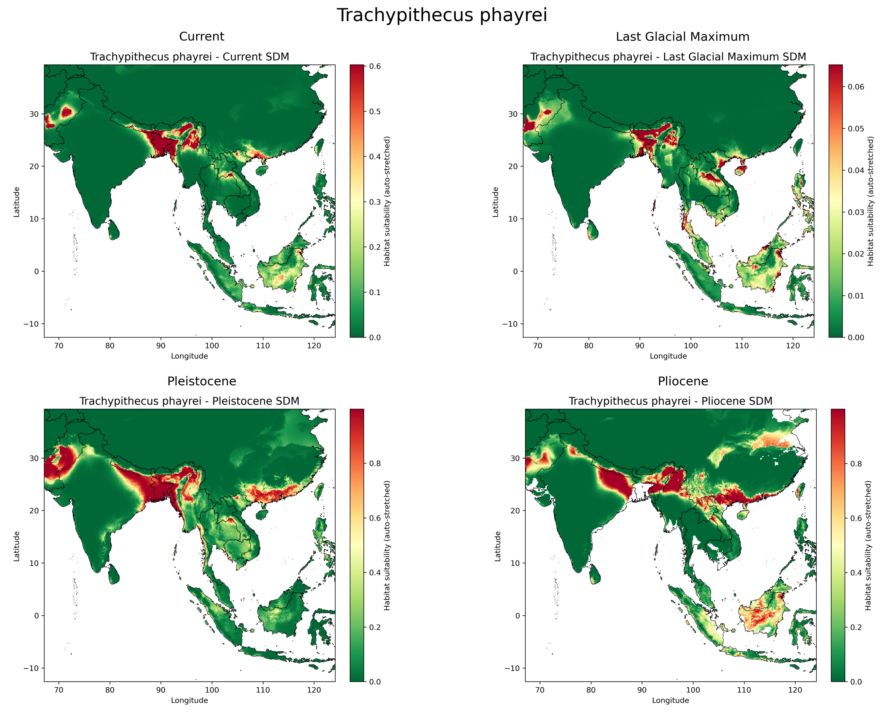
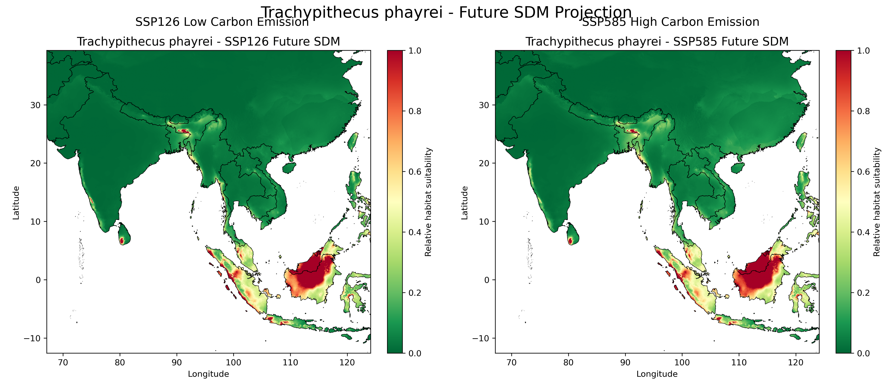

#  Assessing signatures of Climate refugia and future range shifts using bioinformatics and genomic tools

##  Overview

This capstone project integrates ecological, climatic, and genomic datasets to analyze species distribution and historical population dynamics of Asian primates under changing climate conditions.

The study combines:

- Species Distribution Modeling (SDM)
- MaxEnt ecological niche modeling
- MSMC demographic inference
- Climate projections (past, present, future)

##  Objectives

- Predict habitat suitability of Asian primates
- Analyze future range shifts under climate change
- Study historical population dynamics using genomic data
- Support biodiversity conservation planning

##  Species Included

1. Trachypithecus phayrei  
2. Trachypithecus pileatus  
3. Trachypithecus geei  
4. Semnopithecus entellus  

##  Data Sources

- GBIF occurrence data
- WorldClim BIO1–BIO19 variables
- PaleoClim datasets
- CMIP6 future climate scenarios
- SNP/VCF genomic datasets

##  Methodology

### A. Species Distribution Modeling (SDM)

1. Occurrence data cleaning
2. Correlation analysis
3. MaxEnt model training
4. Habitat suitability prediction
5. Future climate projection

### B. MSMC Analysis

1. Variant filtering
2. Multihetsep generation
3. MSMC execution
4. Population history inference

##  Model Performance

- AUC Score: **0.87 – 0.91**
- High predictive accuracy across species

##  Sample Results

### Past Distribution Prediction

### Future Climate Prediction

##  Technologies Used

- Python
- MaxEnt
- MSMC
- Rasterio
- Pandas
- NumPy
- Matplotlib
- Scikit-learn

##  Author

**Srikanth Oruganti**  
Master’s in Data science
University of Arizona

##  Research Impact

This project demonstrates how integrating climate science, ecological modeling, and genomics can help identify biodiversity risk zones and guide conservation strategies under future climate change.
